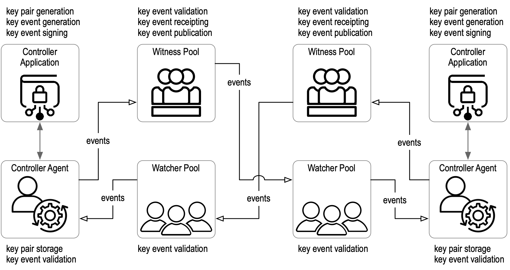

Kerific Specification V0.5
==================

**Specification Status**: Draft

**Latest Draft:**

[https://github.com/weboftrust/kerific-specification](https://github.com/weboftrust/kerific-spec)

**Editors:**

- [Henk van Cann](https://github.com/henkvancann), [Blockchainbird.org](https://blockchainbird.org)
- [Kor Dwarshuis](https://github.com/kordwarshuis), [Blockchainbird.org](https://blockchainbird.org)

**Contributors:**

Test image

Altough this image is IN the images directory of the source, it doesn't show:

On the other hand, directly linked to github (by right clicking it) will show:

<!-- -->

**Participate:**

~ [GitHub repo](https://github.com/weboftrust/kerific-specification)
~ [Commit history](https://github.com/weboftrust/kerific-specification/commits/main)

------------------------------------